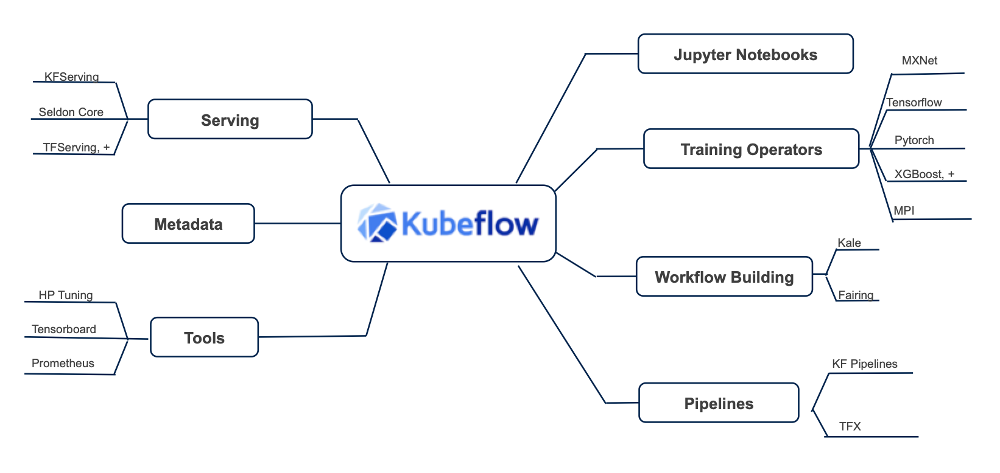

# Kubeflow Workshop for Data Scientists Practicing ML Ops
Repository to hold code, instructions, demos and pointers to presentation assets for [Kubeflow](https://github.com/kubeflow) Workshop. In this workshop, we are going to help data scientists understand the Kubeflow ecosystem and how to  make it easy for develop, deploy, and manage portable, scalable ML everywhere and support the full lifecycle Machine Learning using [Kubeflow](https://www.kubeflow.org/). We are going to discuss how to deploy Kubeflow, and detail how to enable distributed training of models, model serving, canary rollouts, drift detection, model explainability, metadata management, pipelines and others.

If there are developers who want to use this content at their own pace - as well as learn how to manage and contribute to Kubeflow - pre-recorded sessions are uploaded on the original IBM Kubeflow [Dojo](https://github.com/IBM/KubeflowDojo). All credit for code and in this workspace goes to the hard work of the contributors to the original Dojo.

Read about [IBM's journey with Kuebflow here](https://developer.ibm.com/blogs/kubeflow-and-ibm-an-open-source-journey-to-10/)

# Virtual Schedule and Prereqs

**When:** Virtual. 9/17

**Presentations** End to end presentation and walk through on Kubeflow, followed by detailed deep dive and hands on deploying Kubeflow to Minikube and/or IBM Cloud Kubernetes Service (IKS).

**Hands On** Using deployed Kubeflow environments to deploy models and manage Kubeflow environments.

The Kubeflow Slack workspace is kubeflow.slack.com. To join, click this [invitation to Kubeflow Slack workspace](https://join.slack.com/t/kubeflow/shared_invite/zt-cpr020z4-PfcAue_2nw67~iIDy7maAQ). There is a channel **#kubeflow-dojo** created for the workshop.

**Prereqs:** Please look at [kubeflow dev prereqs here](https://github.com/IBM/KubeflowDojo/blob/master/prereqs.md)

**Note:** For Pipelines, we are using [Kubeflow Pipelines with Tekton](https://github.com/kubeflow/kfp-tekton) in this workshop

1st Half: **Presentation Portion**

|Topic|Presenter|Links|
|---|---|---|
|ML Ops - What is it and why care?|Will|[Slides](https://higherlogicdownload.s3.amazonaws.com/IMWUC/UploadedImages/12f13a33-bced-4573-8dd7-be58d519757c/MLOps.pdf)|
|Kubeflow - End to end ML on Kubernetes|Animesh|[Kubeflow End to End](https://www.slideshare.net/AnimeshSingh/end-to-end-machine-learning-using-kubeflowbuild-train-deploy-and-manage) [Dojo Video](https://www.youtube.com/watch?v=TenRufHdK8o)|

2nd Half: **Hands On Portion**

|Topic|Presenter|Links|
|---|---|---|
|Kubeflow Deployment Hands On|Will|[Deployment on IKS](HandsOn/KFDeployment/kubeflow-on-iks.md) [Deployment on minikube](HandsOn/KFDeployment/kubeflow-on-minikube.md) [Dojo Video](https://www.youtube.com/watch?v=8SrTTokXEvw)|
|Extra Credit: Tryout Kubeflow Components |Tommy Recording| [Hands On Notebook](https://github.com/IBM/KubeflowDojo/tree/master/HandsOn/day1) [Dojo Video](https://www.youtube.com/watch?v=0UHGghi3ChA&list=PLmzRWLV1CK_wzDbhB95nImDyaiNrrOg8S&index=7)|
|KFServing deep dive|Will|[Slides](https://www.slideshare.net/AnimeshSingh/kfserving-serverless-model-inferencing-236725227) [Dojo Video](https://www.youtube.com/watch?v=VN2htoRSUzY&list=PLmzRWLV1CK_zYzciXjUrK2IRi3sZzshNl&index=4) [Demo](/HandsOn/KFServing)|
|Extra Credit: Distributed Training and HPO Deep Dive |Andrew, Kevin, Animesh Recording|[Slides](https://www.slideshare.net/AnimeshSingh/kubeflow-distributed-training-and-hpo) [Dojo Video](https://www.youtube.com/watch?v=KJFOlhD3L1E&list=PLmzRWLV1CK_zYzciXjUrK2IRi3sZzshNl&index=5)|

**Recordings for dojo day 1 sessions:** [Kubeflow Dojo Day One Playlist](https://www.youtube.com/playlist?list=PLmzRWLV1CK_wzDbhB95nImDyaiNrrOg8S) 
**Recordings for dojo day 2 sessions:** [Kubeflow Dojo Day Two Playlist](https://www.youtube.com/playlist?list=PLmzRWLV1CK_zYzciXjUrK2IRi3sZzshNl)
